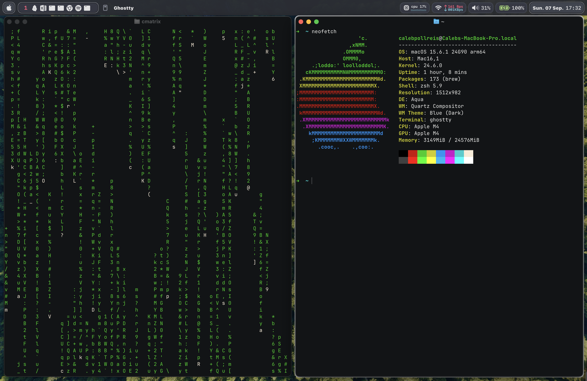

# dotfiles
My macOS configuration files!



* [Aerospace](https://github.com/nikitabobko/AeroSpace)
* [JankyBorders](https://github.com/FelixKratz/JankyBorders)
* [SketchyBar](https://github.com/FelixKratz/SketchyBar)

Most setup steps are in `.install.sh`

SketchyBar Setup
----------------------
The present config for sketchybar is done entirely in lua (and some C), using
[SbarLua](https://github.com/FelixKratz/SbarLua).
One-line install for sketchybar config (requires brew to be installed):
```bash
curl -L https://raw.githubusercontent.com/FelixKratz/dotfiles/master/install_sketchybar.sh | sh
```
* Note: I will modify this in the future to track the Aerospace workspaces instead of the MacOS workspaces!
- The lua script will be modified to match this repo for future installs
